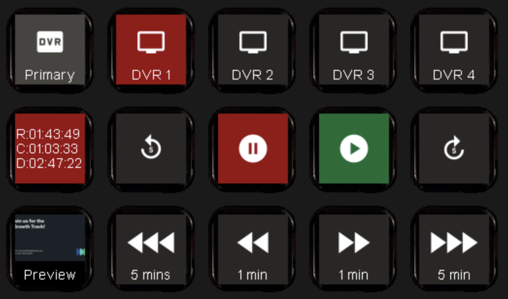

# Haivision Connect DVR Companion Module
This module allows for playback control of the [Haivision Connect DVR](https://www.haivision.com/products/video-services/connect-dvr/), allowing it to run headless and without a typical web browser controller.

This module has been tested on versions 4.2.0 and 4.3.0 of the Connect DVR software, and has been used in multiple and various production environments since April 2019. The controls have also proven to be more reliable than stock control methods for live environments.

## Features
- Loading/playing channels
- Play/pause
- Live output scrubbing (forward/backwards controls)
- Setting and recalling cuepoints
- **Feedbacks**
	- Channel is active (changing colors)
	- Channel is currently downloading/streaming (text and color changes)
	- Output screen is playing/stopped
	- Cuepoints feedback (if saved), offering a screenshot and/or color changes
	- Preview of current output
